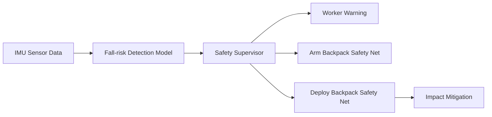

# Backpack Safety Net Integration

## Can the Original Backpack Net Concept Be Linked?

가능하다. 다만 가방 속 그물망은 `Risk Detection Layer` 자체가 아니라, 감지 결과를 받아 작동하는 `Emergency Protection Layer`로 두는 것이 정확하다.

관련 근거:

- OSHA safety net 기준은 안전망을 위험 대응 장치로 다룬다.
- wearable airbag, fall protection pack, smart harness 관련 선행특허는 위험 감지 이후 물리적 보호 장치를 연결하는 방향이 기술적으로 자연스럽다는 참고 근거가 된다.
- 세부 출처와 짧은 발췌는 `docs/evidence_sources.md`에 정리했다.

현재 AI 모델의 역할:

- IMU 움직임 데이터를 보고 `fall_risk` 여부를 감지한다.

가방 그물망의 역할:

- 위험 감지 이후 작업자 충격을 줄이기 위해 전개되는 보호 장치다.

따라서 연결 구조는 다음과 같다.



## Why It Should Be a Separate Layer

위험 감지와 그물망 전개를 같은 단계로 묶으면 설명이 흐려진다.

- `Risk Detection`: 넘어질 가능성을 판단한다.
- `Safety Supervisor`: 그 판단을 실제 행동으로 바꿀지 결정한다.
- `Backpack Safety Net`: 결정이 내려졌을 때 작동하는 보호 장치다.

이렇게 나누면 AI 모델과 하드웨어 제어를 구분할 수 있다. 안전 시스템에서는 이 구분이 중요하다. 모델이 위험을 잘못 판단할 수 있고, 하드웨어가 준비되지 않았을 수도 있기 때문이다.

## Suggested Response Levels

| Model Output | Device State | Response |
| --- | --- | --- |
| Low risk | Any | `monitor` |
| Medium risk | Any | `worker_warning` |
| Elevated risk | Net ready + harness connected | `arm_backpack_safety_net` |
| High risk | Net ready + harness connected + safe deployment height | `deploy_backpack_safety_net` |
| High risk | Net not ready or harness not confirmed | `manager_alert` |

## Concept-level Policy

The policy prototype is implemented in:

- `src/safety_response_policy.py`

It uses:

- fall-risk probability
- backpack net readiness
- harness connection status
- altitude
- manual override

to choose one of:

- `monitor`
- `worker_warning`
- `arm_backpack_safety_net`
- `deploy_backpack_safety_net`
- `manager_alert`
- `hold_manual_override`

## Why This Helps the Project

이 그물망 연결은 현재 프로젝트를 단순 분류 모델에서 실제 제품 구조에 더 가깝게 만든다.

기존 구조:

```text
IMU 데이터 -> fall_risk 분류
```

고도화된 구조:

```text
IMU 데이터 -> fall_risk 감지 -> 안전 정책 판단 -> 가방 그물망 준비/전개
```

이렇게 하면 원래 기획 자료의 가방형 보호 장치와 현재 AI 모델이 자연스럽게 연결된다.

## Important Limitations

현재는 실제 그물망 전개 실험 데이터가 없다. 따라서 다음 값들은 아직 검증되지 않았다.

- 전개 시간
- 전개 성공률
- 추락 중 전개 가능한 최소 높이
- 충격 흡수 성능
- 그물망 고정점 하중
- 오작동 또는 과전개 위험
- 작업자 신체와 하네스에 전달되는 충격

그러므로 문서에서는 `validated deployment system`이라고 주장하면 안 된다. 현재 표현은 다음이 적절하다.

> The current model can trigger a concept-level backpack safety net response policy, but deployment mechanics and impact mitigation must be physically tested.

## Data Needed for Validation

실제 검증을 하려면 다음 데이터가 필요하다.

| Data | Purpose |
| --- | --- |
| Net deployment time | 위험 감지 후 실제 전개가 충분히 빠른지 확인 |
| Deployment success/failure logs | 전개 신뢰성 검증 |
| Load on net anchors | 그물망 고정점 안전성 검증 |
| Fall dummy impact force | 충격 완화 성능 검증 |
| Harness tension during deployment | 작업자 신체에 전달되는 힘 확인 |
| False deployment events | 오작동 위험 평가 |

## How to Explain in Portfolio

추천 설명:

> 현재 구현한 AI 모델은 추락 위험을 감지하는 sensing/risk detection layer입니다. 원래 기획에 있던 가방형 그물망은 이 감지 결과를 받아 작동하는 emergency protection layer로 연결했습니다. 다만 실제 전개 메커니즘과 충격 완화 성능은 아직 물리 실험 데이터가 없어 향후 검증 과제로 분리했습니다.
