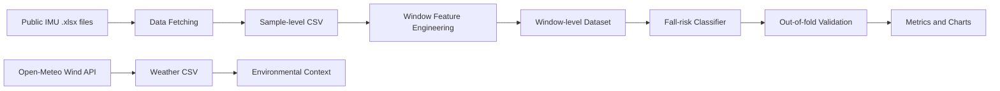
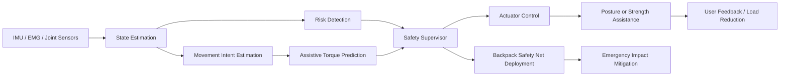

# System Architecture

## Current Scope

현재 프로젝트는 `AI wearable safety monitoring system`이다.

즉, 작업자가 착용한 센서 데이터로 위험 상태를 감지하는 sensing/risk detection layer를 구현했다. 아직 actuator가 힘을 보조하거나 관절 토크를 생성하지 않으므로 wearable robot 또는 exoskeleton 전체 시스템은 아니다.

문제 정의, IMU 센서 근거, fall detection 연구, smart harness/airbag/pack 관련 선행특허는 `docs/evidence_sources.md`에 정리했다.

## Current Data Flow

## Current AI Layer

### Layer 1. Sensing

입력:

- IMU acceleration
- Gyro angular velocity
- Inclination angle
- Historical wind data for environmental context

역할:

- 작업자 움직임과 환경 위험 후보를 데이터로 관찰한다.

현재 한계:

- 로프 장력, 하네스 압력, 작업 현장 풍속은 직접 계측한 값이 아니다.

### Layer 2. Risk Detection

입력:

- Window-level IMU features

출력:

- `normal_activity`
- `fall_risk`

역할:

- 추락 유사 움직임을 감지한다.

현재 한계:

- 위험을 감지할 뿐, 근력 보조나 자세 보조를 수행하지 않는다.

### Layer 3. Emergency Protection Policy

입력:

- fall-risk probability
- backpack safety net readiness
- harness connection status
- altitude
- manual override

출력:

- `monitor`
- `worker_warning`
- `arm_backpack_safety_net`
- `deploy_backpack_safety_net`
- `manager_alert`

역할:

- Risk Detection 결과를 원래 기획의 가방형 그물망 보호 장치와 연결한다.
- 이 계층은 AI 분류 모델이 아니라 안전 정책 계층이다.

현재 한계:

- 실제 그물망 전개 시간, 충격 흡수 성능, 고정점 하중은 검증되지 않았다.

## Future Wearable Robot Architecture

웨어러블 로봇으로 확장하려면 다음 계층이 추가되어야 한다.

## Future AI Layers

### Layer 3. Movement Intent Estimation

목표:

- 사용자가 어떤 움직임을 하려는지 추정한다.

필요 데이터:

- EMG
- joint angle
- joint angular velocity
- IMU

예시 출력:

- walking
- leaning
- recovering balance
- lifting
- stabilizing posture

### Layer 4. Assistive Torque Prediction

목표:

- 관절 또는 하네스 보조부가 얼마만큼의 힘/토크를 제공해야 하는지 예측한다.

필요 데이터:

- EMG
- joint torque / moment
- external load
- actuator torque/current

예시 출력:

- knee assistive torque
- hip assistive torque
- trunk/posture support level
- harness tension assistance level

### Layer 5. Actuator Control

목표:

- 예측된 보조량을 실제 구동부가 안전하게 출력하게 한다.

필요 요소:

- motor or pneumatic actuator
- torque/current limit
- emergency stop
- safety certification logic

### Parallel Safety Layer. Backpack Safety Net Deployment

목표:

- 추락 위험이 매우 높고 장치 준비 상태가 확인되었을 때, 가방형 그물망을 전개해 충격을 줄인다.

필요 데이터:

- net readiness
- deployment time
- deployment success/failure
- net anchor load
- harness tension during deployment
- dummy fall impact force

예시 출력:

- `arm_backpack_safety_net`
- `deploy_backpack_safety_net`
- `manager_alert`

왜 별도 계층인가:

- 그물망은 근력 보조 장치가 아니라 비상 보호 장치다.
- 따라서 assistive torque control과 분리된 emergency protection layer로 두는 것이 정확하다.

## Why This Layered Direction

현재 데이터로는 risk detection까지는 할 수 있다. 하지만 assistive torque나 muscle support를 직접 학습할 수는 없다. 따라서 현재 repo를 sensing/risk detection layer로 두고, 다음 단계에서 EMG/관절토크/actuator 데이터 기반 assistive control layer를 추가하는 구조가 가장 정직하다.

이 구조는 포트폴리오에서도 방어하기 좋다.

- 지금 구현한 것과 아직 구현하지 않은 것을 분리한다.
- 가짜 보조 토크 데이터를 만들지 않는다.
- wearable robot으로 확장하기 위한 데이터와 모델 요구사항을 명확히 제시한다.
- 원래 기획의 가방형 그물망은 risk detection 결과를 받아 작동하는 emergency protection layer로 연결한다.
